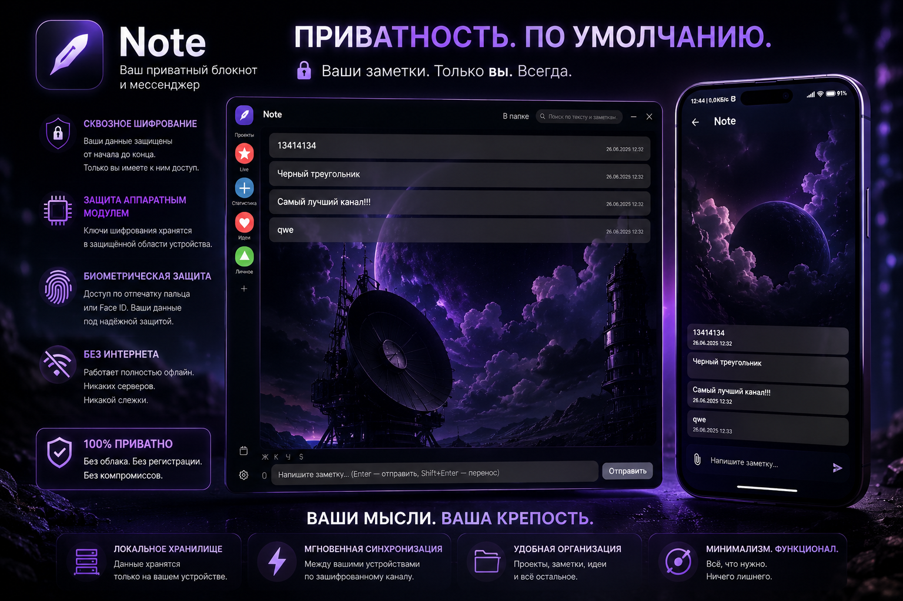

# Note mobile

[English version](README.en.md) | [Подробно в видео](https://www.youtube.com/watch?v=72BAJnBwFic)




**Flutter / Android**-компаньон к [Notes Desktop](https://github.com/HelpFreedom/note-desktop) — приложению
заметок в стиле Telegram, где папки это чаты, а заметки — сообщения.

Приложение **полностью офлайн** (без серверов и телеметрии) и использует ровно тот же
протокол peer-to-peer синхронизации и формат шифрования на диске, что и десктоп — поэтому
телефон и компьютер сходятся к одним и тем же заметкам по локальной сети.

> Десктоп-приложение (PySide6 / Qt 6): **[notes-desktop](https://github.com/HelpFreedom/note-desktop)**.

---

## Возможности

- **Папки как чаты, заметки как сообщения** — та же ментальная модель, что на десктопе.
- Текстовые и форматированные заметки, вложения-картинки и файлы, подписи.
- **Peer-to-peer синхронизация** с десктопом и другими телефонами:
  - mutual-TLS с пиннингом сертификата, обнаружение по **mDNS**, **сопряжение по QR**;
  - append-only **журнал операций** с **version vectors** и last-writer-wins;
  - удаления фиксируются tombstone'ами; кросс-языковой conformance-набор держит
    семантику телефона и десктопа байт-совместимой.
- **Локальное шифрование** за ПИНом:
  - всё хранилище **AES-256-GCM** (субключи на файл через HKDF);
  - аппаратный гейт через **Android Keystore** (на поддерживаемых устройствах — через
    StrongBox), с integrity-MAC поверх keyring;
  - опциональная **привязка к биометрии** — ключ-гейт требует аутентификации
    пользователя и разблокированного устройства, поэтому украденный заблокированный
    телефон нельзя перебрать офлайн;
  - режим **duress** (обратный ПИН): крипто-стирает keyring, удаляет владеемые пути и
    показывает подложные заметки.
- **Блокировка при уходе в фон**: мастер-ключ забывается, а кэш расшифрованного медиа
  стирается всякий раз, когда приложение покидает передний план.
- **`FLAG_SECURE`** (нет скриншотов, пустая миниатюра в списке недавних) и буфер обмена,
  помеченный как чувствительный на Android 13+.

---

## Требования

- [Flutter SDK](https://docs.flutter.dev/get-started/install) (stable) с входящим в него
  Dart SDK.
- Android SDK / устройство или эмулятор (разрабатывалось на физическом Android-устройстве).

## Сборка и запуск

```bash
flutter pub get

# запуск на подключённом устройстве / эмуляторе
flutter run

# release-APK (обфускация + раздельные debug-символы)
flutter build apk --release --obfuscate --split-debug-info=build/symbols
# -> build/app/outputs/flutter-apk/app-release.apk
```

> По умолчанию release подписывается debug-ключом Flutter. Для настоящего релиза
> настройте собственный ключ подписи в `android/` (и **не** коммитьте keystore или
> `key.properties`).

## Тесты

Чистая Dart-логика (синхронизация, oplog, крипто, хранилище, поиск) гоняется **headless**
обычным Dart-тест-раннером — без устройства и эмулятора:

```bash
dart test                                  # весь набор
dart test test/sync_tombstones_test.dart   # один файл
```

Кросс-языковые conformance-тесты (`golden_conformance_test.dart`,
`convergence_conformance_test.dart`) запускаются Python-обвязкой десктопа, когда оба
проекта присутствуют; сами по себе они пропускаются.

## Структура проекта

```
lib/
  main.dart
  app/        app_service (жизненный цикл, lock/unlock, движок), repository
  storage/    модели, vault, search_index, кэш заметок
  sync/       engine, oplog, apply, wire, transport, discovery, pairing, identity
  crypto/     unlock, keyvault, keystore, crypto_fs, blob_crypto, duress, primitives
  ui/         экраны и виджеты (чат, папки, календарь, поиск, синк, пин)
android/      Kotlin-хост (Keystore HMAC-гейт, FLAG_SECURE, чувствительный буфер)
test/         headless Dart-логика + conformance-тесты
```

---

## О безопасности

Это личный проект, а не профессионально проаудированный security-продукт. Шифрование и
duress — это **защита в глубину**, рассчитанная прежде всего на кражу устройства и
принуждение, пока устройство заблокировано. Как только у атакующего есть root на
устройстве, где приложение **сейчас разблокировано**, ключ находится в памяти, и никакая
программная схема его не защитит. Аппаратные гарантии (StrongBox, анти-откатные счётчики)
различаются между устройствами. Не полагайтесь на это приложение как на единственную
защиту критически важных секретов без собственной проверки.

Нашли проблему безопасности — заведите issue (или сообщите приватно, если предпочитаете).

## Лицензия

[GNU GPL v3.0](LICENSE) — можно использовать, изучать, изменять и распространять, но
производные работы тоже должны выходить под GPL.
